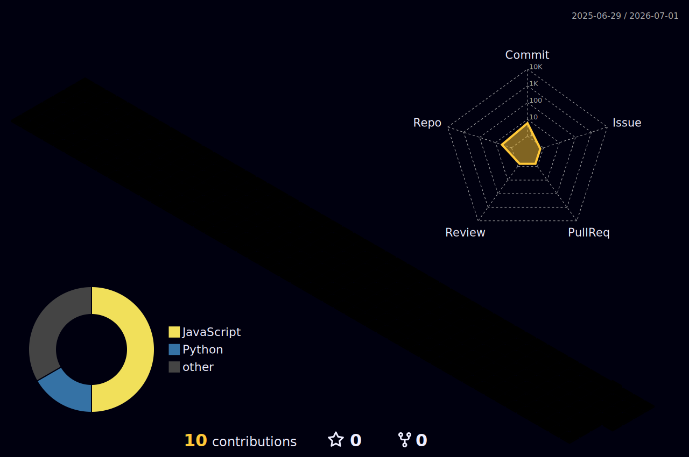

<div align="center">


</div>

<div align="center">


<br/>

[](https://linkedin.com/in/guilherme-zin)
[](mailto:guilhermeti.famcred@gmail.com)
[](https://github.com/Guilherme-Zin)

<br/>


</div>

---

<br/>


### 👨‍💻 Quem sou eu?

```typescript
const guilherme: Developer = {
  nome:     "Guilherme Zin",
  cargo:    "Líder de Desenvolvimento",
  empresa:  "Famtech · Grupo FAM",
  setor:    "Fintech & Serviços Financeiros",

  stack:    {
    linguagens:  ["TypeScript", "JavaScript", "Python"],
    backend:     ["Node.js", "NestJS", "Express"],
    automação:   ["Selenium", "Puppeteer", "Playwright"],
    banco_dados: ["PostgreSQL", "MongoDB", "Redis"],
    devops:      ["Docker", "AWS", "GitHub Actions"],
  },

  atuando:  "Liderando times e construindo soluções financeiras 🏦",
  missão:   "Automatizar o repetível, humanizar o essencial ⚡",
};
```

<br clear="right"/>

<br/>

---

### 🏦 Sobre meu Trabalho

<table>
  <tr>
    <td align="center" width="33%">
      <br/>
      <sub>Robôs de consulta de margem integrados a múltiplos bancos (BMG, Santander, Bahia, Amazonas)</sub>
    </td>
    <td align="center" width="33%">
      <br/>
      <sub>APIs e sistemas de crédito consignado conectando fintechs a bancos parceiros</sub>
    </td>
    <td align="center" width="33%">
      <br/>
      <sub>Plataformas internas de controle financeiro, relatórios e dashboards em tempo real</sub>
    </td>
  </tr>
</table>

---

### 🛠️ Stack Tecnológica

<div align="center">

**Linguagens & Runtimes**


**Frameworks & Automação**


**Bancos de Dados**


**DevOps & Infraestrutura**


**Ferramentas**


</div>

---

### 🔒 Projetos em Destaque

> *Repositórios privados — código confidencial por questões de segurança corporativa e compliance bancário.*

<div align="center">

| &nbsp; | Projeto | Descrição | Stack |
|:------:|---------|-----------|-------|
| 🏦 | **FAMTECHCENTRAL BMG** | Sistema central de integração com Banco BMG — gestão de operações, fluxos de crédito consignado e margem | `TypeScript` `Node.js` `PostgreSQL` |
| 💰 | **FINANCE CTRL** | Plataforma interna de controle financeiro com dashboards analíticos, relatórios automatizados e alertas | `TypeScript` `Node.js` `MongoDB` |
| 🤖 | **Robô BMG Unitário** | Automação de consultas de margem consignada integrada diretamente aos sistemas do Banco BMG | `Python` `Selenium` |
| 🤖 | **Robô Bahia Unitário** | Automação de processamento de margem para o Banco do Estado da Bahia | `Python` `Selenium` |
| 🤖 | **Robô Santander RJ** | Consulta automatizada de margem junto ao Santander — unidade Rio de Janeiro | `Python` `Selenium` |
| 📋 | **CONSULTA CDX** | Sistema de consulta ao cadastro CDX integrado ao ecossistema Famtech | `HTML` `JavaScript` |

</div>

---

### 📊 GitHub Stats

<div align="center">


</div>

<div align="center">
  
</div>

---

### 🏆 Troféus

<div align="center">
  
</div>

---

### 🗓️ Calendário de Contribuições 3D

<div align="center">
  
</div>

---

### 🐍 Contribuições

<picture>
  <source media="(prefers-color-scheme: dark)" srcset="https://raw.githubusercontent.com/Guilherme-Zin/Guilherme-Zin/output/github-contribution-grid-snake-dark.svg" />
  <source media="(prefers-color-scheme: light)" srcset="https://raw.githubusercontent.com/Guilherme-Zin/Guilherme-Zin/output/github-contribution-grid-snake.svg" />
  
</picture>

---

### 📈 Gráfico de Atividade

<div align="center">
  
</div>

---

<div align="center">


</div>

<div align="center">
  
</div>
